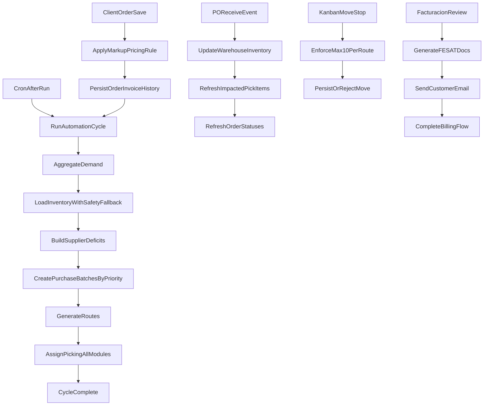

# Master Plan: Close All Remaining Gaps

## Scope

Deliver all remaining requirements in one coordinated program:

- Single scheduled trigger runs all 3 domains every cycle (PO + Routes + Picking assignment).
- S_SEGURIDAD is enforced in automation using dual-fallback source.
- Supplier grouping is reliable (no null-supplier collapse) with priority-respecting batching.
- Receiving events propagate to affected picking items/orders automatically.
- Pricing logic is consistent with business rule: customer percentage acts as markup on cost.
- Route capacity is strictly capped at 10 customers (generation and manual moves).
- Facturacion includes FE-SAT generation and workflow-level email delivery.

## Target Files

- [modules/ramos/helpers/ramos_automation_helper.php](/var/www/ramos-php/modules/ramos/helpers/ramos_automation_helper.php)
- [modules/ramos/models/Automation_model.php](/var/www/ramos-php/modules/ramos/models/Automation_model.php)
- [modules/ramos/models/Purchase_model.php](/var/www/ramos-php/modules/ramos/models/Purchase_model.php)
- [modules/ramos/models/Picking_model.php](/var/www/ramos-php/modules/ramos/models/Picking_model.php)
- [modules/ramos/controllers/Purchases.php](/var/www/ramos-php/modules/ramos/controllers/Purchases.php)
- [modules/ramos/install.php](/var/www/ramos-php/modules/ramos/install.php)
- [modules/ramos/models/Inventory_model.php](/var/www/ramos-php/modules/ramos/models/Inventory_model.php)
- [modules/ramos/models/Suppliers_model.php](/var/www/ramos-php/modules/ramos/models/Suppliers_model.php)
- [application/controllers/Clients.php](/var/www/ramos-php/application/controllers/Clients.php)
- [application/views/themes/perfex/views/home.php](/var/www/ramos-php/application/views/themes/perfex/views/home.php)
- [application/models/Invoices_model.php](/var/www/ramos-php/application/models/Invoices_model.php)
- [modules/ramos/controllers/Routes.php](/var/www/ramos-php/modules/ramos/controllers/Routes.php)
- [modules/ramos/views/routes/board.php](/var/www/ramos-php/modules/ramos/views/routes/board.php)
- [modules/ramos/controllers/Facturacion.php](/var/www/ramos-php/modules/ramos/controllers/Facturacion.php)
- [modules/ramos/libraries/Ramos_invoice_generator.php](/var/www/ramos-php/modules/ramos/libraries/Ramos_invoice_generator.php)
- [modules/ramos/views/facturacion/remision_pdf.php](/var/www/ramos-php/modules/ramos/views/facturacion/remision_pdf.php)

## Implementation Plan

### Phase 0: Guardrails and rollout controls

- Add feature flags/options for:
  - strict single-cycle orchestration
  - strict route max-cap enforcement
  - FE-SAT/email rollout toggle
- Keep new paths backward-compatible and observable via logs.

### Phase 1: Automation and inventory core (P0)

#### 1) Enforce strict single-trigger orchestration

- Update scheduled execution in `ramos_automation_helper.php` so one cycle always runs, in order:
  1. demand + deficit + PO generation
  2. route generation
  3. full picking assignment for all active modules
- Move picking assignment call into the same orchestration function used by cron path.
- Add cycle-level logging/status markers to prove each stage executed (and where it failed).

#### 2) Implement S_SEGURIDAD dual-fallback in automation inventory feed

- In `Automation_model.php`, replace hardcoded `safety_stock = 0` behavior with:
  - primary: product master safety field (S_SEGURIDAD or mapped equivalent)
  - fallback: Ramos mapping safety stock
  - final default: 0 only if both are absent
- In `install.php`, add missing schema support only if required (non-breaking migration checks).
- Keep read path backward-compatible for existing rows without safety metadata.

#### 3) Harden supplier linkage and priority batching

- In `Automation_model.php` + `Purchase_model.php`, guarantee each deficit line has deterministic supplier resolution:
  - primary supplier mapping from product/provider mapping
  - fallback to configured default supplier bucket (explicit id, not null)
- In `Purchase_model.php`, enforce stable sort by supplier priority before batch creation.
- Ensure generated PO batches preserve supplier grouping and item partitioning predictably.

#### 4) Receiving -> picking propagation

- In `Purchases.php::receive()` after inventory updates, invoke propagation service/model method.
- In `Picking_model.php`, add method to refresh impacted pick items/orders by product/date scope:
  - recalculate item status (`pending`, `weight_missing`, `completed`) using current availability/requirements
  - refresh parent order status after item updates
- Keep operation idempotent so repeated receipts do not corrupt statuses.

### Phase 2: Commercial and routing rules

#### 5) Pricing rule unification (Order Placement)

- Standardize one backend source of truth for price math:
  - `unit_price = cost * (1 + customer_percent/100)`
- Align UI previews in `home.php` with backend persist path in `Clients.php`.
- Remove/contain conflicting invoice discount interpretation where it contradicts markup rule for this workflow.
- Add regression checks for mixed customer data (no value, zero, positive values).

#### 6) Strict route capacity cap of 10

- Enforce hard max of 10 in route generation (`Routes_model`/`Routes` controller inputs).
- Enforce cap in Kanban moves (`Routes::move_stop`) so cross-route drag cannot exceed 10.
- Return actionable validation messages in UI (`routes/board.php`) when move is rejected.

### Phase 3: Facturacion completion

#### 7) FE-SAT + email dispatch integration

- Extend Facturacion flow to produce FE-SAT output artifacts (according to current fiscal integration pattern used in project, if available).
- Persist reference IDs/status and expose them in Facturacion screens.
- Add workflow-level email dispatch after successful document generation, with retry-safe behavior and audit logging.

### Data flow and control flow alignment

### Verification strategy

- Scheduler path: run one cycle and confirm logs show all three stages executed in sequence.
- Safety stock: test cases for product-level value, fallback value, and both-missing.
- Supplier grouping: confirm no null supplier groups; verify priority ordering across batches.
- Receiving propagation: receipt of partial/full PO updates impacted pick statuses and parent order statuses.
- Pricing: UI and backend produce identical totals for same inputs.
- Route cap: generation and Kanban moves cannot exceed 10 customers on any route.
- Facturacion: FE-SAT artifacts and email logs are generated once, with idempotent retries.
- End-to-end: order -> automation -> PO/receive -> picking -> facturacion output is fully traceable.

## Risks and Guardrails

- Avoid breaking legacy manual purchase screens by confining new logic to automation read path.
- Use feature flags/options for default supplier fallback and strict-cycle enforcement if rollback is needed.
- Preserve existing status enums and only add transition logic where necessary.
- Keep FE-SAT/email integration behind a controlled rollout until stable in staging.

